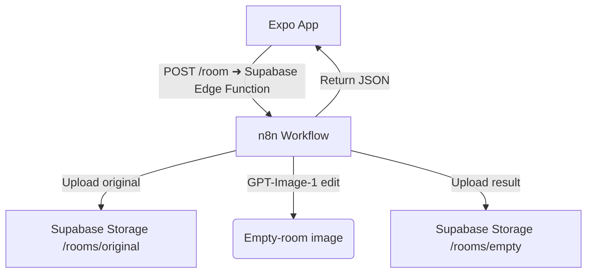

# DecorAI — MVP Product Requirement Document
*(Optimized for Expo Go SDK 53 + Supabase + Cursor IDE)*

---

## 1 · Product Summary  
DecorAI lets homeowners snap a picture of any room, have AI remove all movable items, and instantly preview an **empty‑room** photo they can download or share. This “clean slate” is the magic moment; furniture suggestions and e‑commerce come later.

---

## 2 · Goals & Success Metrics

| Goal | KPI | Target (MVP) |
|------|-----|--------------|
| Deliver a working empty‑room preview in < 15 s end‑to‑end | Avg. processing time | ≤ 15 s |
| Provide a crash‑free experience | Crash‑free sessions | ≥ 99 % |
| Validate core value prop | Day‑7 survey: “Would use again?” | ≥ 40 % positive |

---

## 3 · Personas & Top User Stories

| Persona | Story (BDD) | Acceptance Criteria |
|---------|-------------|---------------------|
| **DIY Homeowner** | *When I open the app for the first time*<br>*I want to see a simple intro and camera button*<br>*So that I can quickly try the feature without creating an account.* | No sign‑up required; “Get Started” goes straight to camera. |
| **Renter Staging Apartment** | *When I upload a photo of my living room*<br>*I want AI to return an empty version*<br>*So I can imagine new furniture layouts.* | Result shows before/after toggle; edited image has no previous furniture. |
| **Interior‑Design Enthusiast** | *When I see the empty room*<br>*I want to save it to my camera roll or share it by link*<br>*So I can discuss ideas with friends.* | “Save” writes to Photos; “Share” opens native share sheet with result URL. |

_All other sign‑up, product search, and purchase flows are **out of scope** for MVP._

---

## 4 · Scope (MVP)

| In | Out |
|----|-----|
| Onboarding splash with “Get Started” | Email/password sign‑up |
| Capture/Upload room photo | Social login, retail‑account linking |
| Upload ➜ Supabase Storage ➜ n8n ➜ OpenAI GPT‑Image‑1 **edit** | 3‑D room placement, AR view |
| Polling for result URL | Product suggestions, cart, checkout |
| Before/After slider & share | Push notifications, analytics |

---

## 5 · App Architecture



| Layer | Choice | Notes |
|-------|--------|-------|
| **Frontend** | Expo Go SDK 53, React Navigation v7 | Managed workflow; works in Cursor without ejecting. |
| **Backend Orchestrator** | n8n Cloud (single workflow) | Handles GPT‑Image‑1 call & storage. |
| **Storage / Auth / DB** | **Supabase** | Storage buckets: `rooms/original`, `rooms/empty`<br>Public RLS off for storage buckets only (signed URLs). |
| **AI** | OpenAI `gpt-1-image` (**edit**) | Prompt: “Remove all movable furniture and decor; keep walls, floor, windows unchanged.” |

---

## 6 · API Contracts

### 6.1  POST `/empty-room` (Edge Function)

| Field | Type | Notes |
|-------|------|-------|
| `file` | **multipart file** | JPEG/PNG from Expo upload |
| Response `200` | `{ "jobId": "uuid" }` |

### 6.2  GET `/empty-room/:jobId`

| Field | Type | Notes |
|-------|------|-------|
| `status` | `"processing" \| "done" \| "error"` | |
| `originalUrl?` | string | Signed Supabase URL |
| `emptyUrl?` | string | Signed Supabase URL |

---

## 7 · Milestones & Timeline

| Day | Task |
|-----|------|
| **0** | Scaffold repo: `npx create-expo-app decorai`; push to GitHub. |
| **0** | Create Supabase project, buckets, Edge Function template. |
| **1** | Build Splash ➜ Camera ➜ Preview flow with dummy image. |
| **1** | Set up n8n: Webhook ➜ Supabase upload ➜ GPT‑Image‑1 ➜ upload result. |
| **2** | Wire Edge Function to n8n; return `jobId`. |
| **2** | Implement polling + ActivityIndicator; Before/After slider. |
| **3** | Add Save/Share; TestFlight & Google internal testing. |
| **4** | Friend‑and‑family beta; collect feedback; bug fixes. |

---

## 8 · Risks & Mitigations

| Risk | Impact | Mitigation |
|------|--------|-----------|
| GPT‑Image‑1 latency > 15 s | Poor UX | Queue in n8n; progress dots; lower `size` param. |
| Supabase free‑tier bandwidth | Cost overrun | Cache result URLs; delete files after 30 days (cron). |
| iOS permission prompts scare users | Drop‑off | Pre‑permission screen explaining camera need. |

---

## 9 · Open Questions

1. Final color palette & logo (current mock‑ups use warm beige/brown).  
2. Analytics solution (PostHog, Expo Updates?) for post‑MVP.  
3. GDPR data‑retention policy for uploaded images.

---

## 10 · Appendix — Key Supabase Config

```sql
-- Table to track jobs
create table public.room_jobs (
  id uuid primary key default gen_random_uuid(),
  user_id uuid,
  original_path text,
  empty_path text,
  status text default 'processing',
  created_at timestamp default now()
);

-- Storage buckets
create bucket storage.rooms; -- public-read
-- CORS: allow POST/GET from Expo dev URLs
```

Edge Function skeleton (`supabase/functions/empty-room.ts`):

```ts
import { serve } from 'https://deno.land/x/sift@0.6.0/mod.ts'
import { createClient } from 'https://esm.sh/@supabase/supabase-js@2'

serve(async (req) => {
  if (req.method === 'POST') {
    // parse multipart, insert row, call n8n
  }
  if (req.method === 'GET') {
    // return status + URLs
  }
})
```
